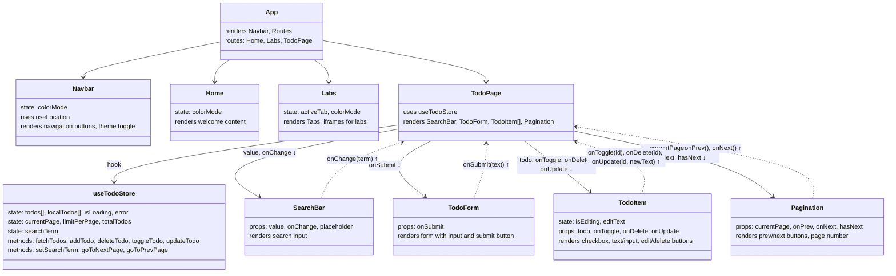

# Student Portfolio

Веб-застосунок (SPA) портфоліо студента, що демонструє навички роботи з сучасним стеком React.

## Технологічний стек

- **React 18+** з Vite
- **React Router DOM v6** для маршрутизації
- **Chakra UI** для компонентів та темної теми
- **Zustand** для управління глобальним станом
- **Axios** для HTTP запитів
- **React Icons** для іконок

## Функціональність

### Сторінки

1. **Головна (Home)** - привітання та опис проєкту
2. **Лабораторні (Labs)** - список виконаних лабораторних робіт з посиланнями
3. **Todo App** - повнофункціональний список завдань

### Todo App функціонал

- Завантаження завдань з API (dummyjson.com/todos)
- Додавання локальних завдань
- Видалення завдань
- Редагування тексту завдань (клік на текст або кнопка редагування)
- Відмітка виконано/не виконано
- Пошук/фільтрація завдань
- Пагінація для API завдань
- Збереження стану при переході між сторінками (Zustand)

## Дизайн

- Неоново-зелений та ціановий кольори
- Підтримка світлої та темної теми
- Адаптивний дизайн
- Мінімізація ререндерингу через memo та useMemo

## Запуск проєкту

```bash
# Встановлення залежностей
npm install

# Запуск dev сервера
npm run dev

# Збірка для продакшн
npm run build
```

## Структура проєкту

```
src/
├── components/      # Перевикористовувані компоненти
│   ├── Navbar.jsx
│   ├── TodoItem.jsx
│   ├── TodoForm.jsx
│   ├── SearchBar.jsx
│   └── Pagination.jsx
├── pages/          # Сторінки застосунку
│   ├── Home.jsx
│   ├── Labs.jsx
│   └── TodoPage.jsx
├── store/          # Zustand store
│   └── useTodoStore.js
├── theme.js        # Кастомна тема Chakra UI
├── App.jsx
└── main.jsx
```

## Дерево компонентів


