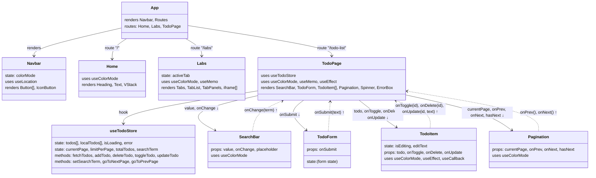

```mermaid
classDiagram
  class App {
    renders Navbar, Routes
    routes: Home, Labs, TodoPage
  }

  class Navbar {
    state: colorMode
    uses useLocation
    renders Button[], IconButton
  }

  class Home {
    uses useColorMode
    renders Heading, Text, VStack
  }

  class Labs {
    state: activeTab
    uses useColorMode, useMemo
    renders Tabs, TabList, TabPanels, iframe[]
  }

  class TodoPage {
    uses useTodoStore
    uses useColorMode, useMemo, useEffect
    renders SearchBar, TodoForm, TodoItem[], Pagination, Spinner, ErrorBox
  }

  class useTodoStore {
    state: todos[], localTodos[], isLoading, error
    state: currentPage, limitPerPage, totalTodos, searchTerm
    methods: fetchTodos, addTodo, deleteTodo, toggleTodo, updateTodo
    methods: setSearchTerm, goToNextPage, goToPrevPage
  }

  class TodoForm {
    state: (form state)
    props: onSubmit
  }

  class SearchBar {
    props: value, onChange, placeholder
    uses useColorMode
  }

  class TodoItem {
    state: isEditing, editText
    props: todo, onToggle, onDelete, onUpdate
    uses useColorMode, useEffect, useCallback
  }

  class Pagination {
    props: currentPage, onPrev, onNext, hasNext
    uses useColorMode
  }

  App --> Navbar : renders
  App --> Home : route "/"
  App --> Labs : route "/labs"
  App --> TodoPage : route "/todo-list"
  TodoPage --> useTodoStore : hook
  TodoPage --> SearchBar : value, onChange ↓
  TodoPage --> TodoForm : onSubmit ↓
  TodoPage --> TodoItem : todo, onToggle, onDelete, onUpdate ↓
  TodoPage --> Pagination : currentPage, onPrev, onNext, hasNext ↓
  SearchBar ..> TodoPage : onChange(term) ↑
  TodoForm ..> TodoPage : onSubmit(text) ↑
  TodoItem ..> TodoPage : onToggle(id), onDelete(id), onUpdate(id, text) ↑
  Pagination ..> TodoPage : onPrev(), onNext() ↑
```

